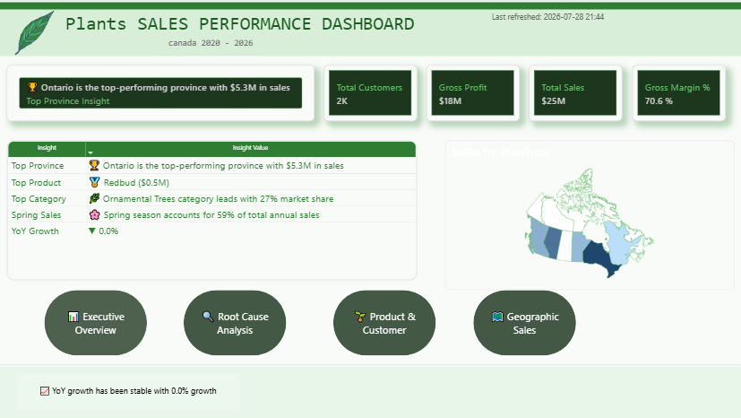
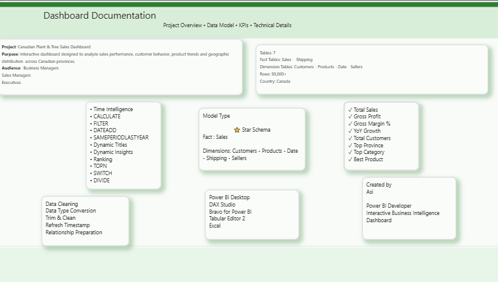
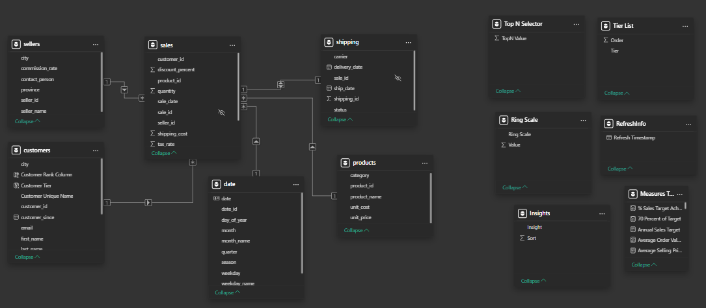
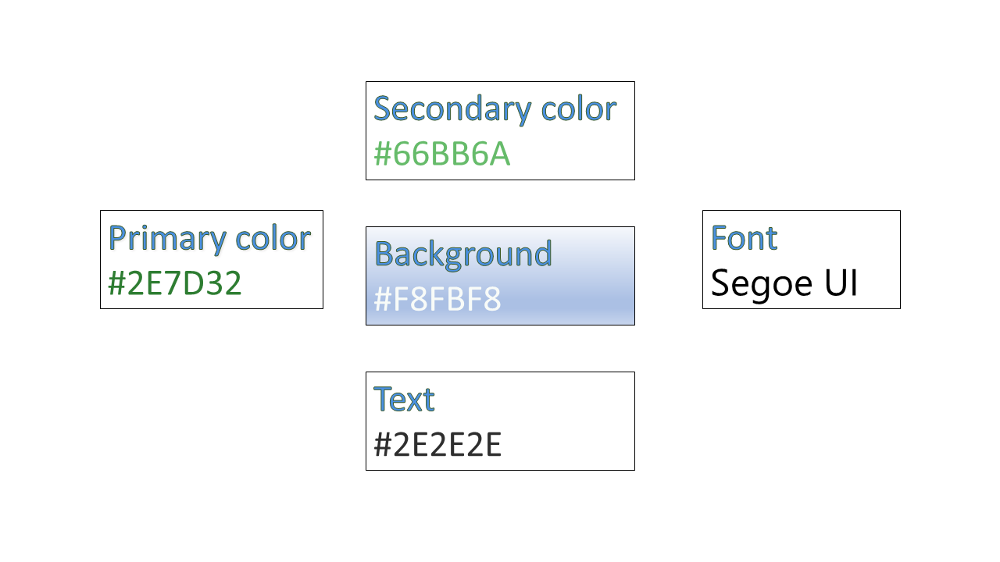

# 🌿 Sales Analytics Dashboard | Power BI

## 📊 Project Overview

This project is an interactive **Power BI Sales Analytics Dashboard** designed to help business stakeholders monitor sales performance, identify trends, evaluate targets, and make data-driven decisions.

The report combines executive KPIs with interactive analytical pages, enabling users to explore sales performance across **products, customers, time, and geography**.

---

## 🚀 Dashboard Features

* Executive KPI Monitoring
* Interactive Slicers
* Dynamic KPI Cards
* Year-over-Year Analysis
* Sales Target Achievement
* Root Cause Analysis
* Geographic Sales Analysis
* Product & Customer Insights
* Dynamic Insight Measures
* Custom Report Tooltips
* Performance-Optimized Data Model

---

## 📑 Dashboard Pages

### 🏠 Home

Navigation page providing access to the main analytical sections of the report.

### 📈 Executive Overview

High-level business KPIs, sales performance, profitability, and trends.

### 🔍 Root Cause Analysis

Uses a **Decomposition Tree** to investigate the factors driving sales performance.

### 🌿 Product & Customer Insights

Analyzes product performance and customer-related sales patterns.

### 🗺 Geographic Sales

Provides interactive province-level geographic analysis of sales performance.

---

## 📌 Key Performance Indicators

* Total Sales
* Gross Profit
* Gross Margin %
* YoY Growth
* Sales Target Achievement
* Top Province
* Highest Sales Category
* Best-Selling Product
* Best Sales Month
* Best Sales Year

---

## 🛠 Tools & Technologies

* Microsoft Power BI Desktop
* DAX
* Power Query
* Tabular Editor
* Bravo for Power BI
* DAX Studio

---

## ⚡ Performance Optimization

The report has been optimized using:

* Star Schema Data Model
* Optimized DAX Measures
* Bravo for Power BI
* DAX Studio / VertiPaq Analyzer
* Custom Report Tooltips
* Organized Measures
* Removal of Unused Objects

---

## 📸 Dashboard Preview

### 🏠 Home

### 📈 Executive Overview

### 🔍 Root Cause Analysis

### 🌿 Product & Customer Insights

### 🗺 Geographic Sales

### 📋 Documentation

---

## 📚 Documentation

Additional project documentation, including the data model, color theme, and project presentation, is available in the **Documentation** folder.

### Data Model

### Color Theme

📄 [View Project Presentation (PDF)](./Documentation/SALES%20ANALYTICS%20DASHBOARD%20PLANTS.pdf)
---

## 💡 Key Skills Demonstrated

* Data Modeling
* DAX Development
* Time Intelligence
* Power Query
* Dashboard Design
* Business Intelligence
* Data Visualization
* Business Analysis
* Performance Optimization

---

## 🎯 Project Objective

The objective of this dashboard is to transform sales data into actionable business insights by providing stakeholders with an interactive environment for monitoring performance, identifying trends, and exploring the underlying drivers of sales.

## 💡 Key Business Insights

The dashboard uses **dynamic DAX-driven insights** to automatically translate sales metrics into concise business findings.

### 📍 Leading Province

**Ontario** is the leading province, contributing **21% of total sales**.

### 🌳 Top-Performing Category

**Ornamental Trees** is currently the best-performing product category.

### 🌸 Seasonal Performance

**Spring accounts for 59% of total annual sales**, highlighting a strong seasonal concentration in the business.

### 📈 Year-over-Year Performance

The current report context shows **0.0% YoY growth**, indicating stable performance compared with the previous year.

### ⚡ Dynamic Executive Insight

A consolidated executive insight dynamically combines:

* Top-performing province
* Province contribution to total sales
* Best-performing product category
* Year-over-year sales performance

The insight updates dynamically according to the report's filter context, allowing users to explore changing business results interactively.

### 🧠 DAX Techniques Used

The dynamic insights use advanced DAX concepts including:

* `TOPN`
* `ADDCOLUMNS`
* `VALUES`
* `MAXX`
* `CALCULATE`
* `DATEADD`
* `DIVIDE`
* `SELECTEDVALUE`
* `SWITCH`
* Dynamic text generation with `FORMAT`
